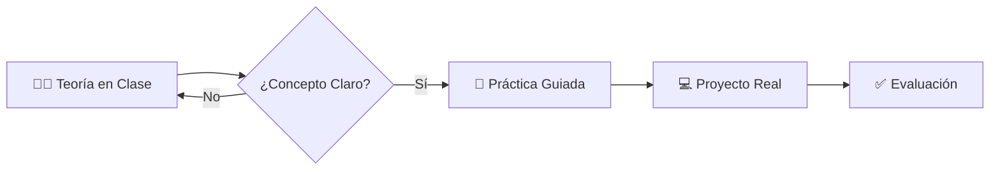

# 👋 Bienvenido/a al Aula Virtual

!!! quote ""
    *"La informática no trata sobre ordenadores, trata sobre resolver problemas."*

Hola, soy **Jose**, Ingeniero Informático y Profesor de Ciclos Formativos de la familia de Informática y Comunicaciones en la **Comunidad Valenciana**.

Este sitio web es el repositorio central de apuntes, laboratorios y recursos para mis alumnos. Aquí encontrarás todo lo necesario para sobrevivir (y disfrutar) del curso.

---

## 🎯 ¿Qué vas a encontrar aquí?

Este curso nos centraremos en aprender haciendo (*Learning by doing*). La documentación está estructurada para guiarte desde los conceptos teóricos hasta la implementación práctica.

=== "💻 Desarrollo (DAM/DAW)"
    * **Programación:** Python, Java y C#.
    * **Entornos de Desarrollo:** Git, Docker y VS Code.
    * **Bases de Datos:** SQL y NoSQL.

=== "⚙️ Sistemas (ASIR/SMR)"
    * **Sistemas Operativos:** Administración avanzada de Linux y Windows Server.
    * **Redes:** Configuración de servicios y seguridad.
    * **Hardware:** Montaje y diagnóstico.

=== "🛡️ Ciberseguridad"
    * Hacking Ético.
    * Análisis Forense.
    * Bastionado de redes.

---

## 🛠️ Metodología de Trabajo

Para aprobar y sacar el máximo partido a los módulos, seguiremos este flujo de trabajo:

!!! tip "Consejo para el alumno"
    No te limites a copiar y pegar código. Intenta entender **por qué** funciona. Romper cosas en el entorno de pruebas es la mejor forma de aprender.

---

## 📅 Estado del Curso

!!! info "Novedades 2024/2025"
    * **Nuevo:** Módulo de IA aplicada al desarrollo.
    * **Actualizado:** Temario de Contenedores con Docker y Kubernetes.

| Módulo | Estado | Enlace Rápido |
| :--- | :---: | :--- |
| **Programación** | 🟢 Activo | [Ir al temario](#) |
| **Bases de Datos** | 🟡 En revisión | [Ir al temario](#) |
| **Entornos** | 🔴 Pendiente | Próximamente |

---

## 📬 Contacto y Tutorías

Si tienes dudas fuera del horario de clase, puedes contactarme por las vías oficiales de la Conselleria o plataformas del centro.

* 📧 **Email:** `tu.email@edu.gva.es`
* 🏫 **Departamento:** Informática
* 🕒 **Tutorías:** Martes de 11:00 a 12:00

!!! warning "Importante"
    Para consultas técnicas sobre prácticas, por favor usad el foro de Aules antes de enviar un correo, así la duda resuelta sirve para todos los compañeros.
